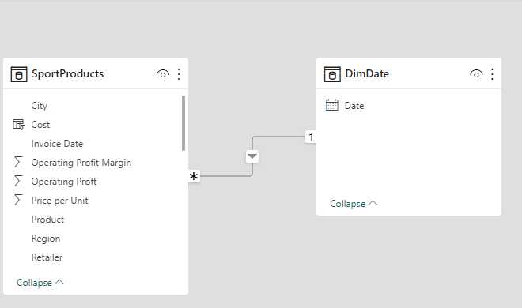
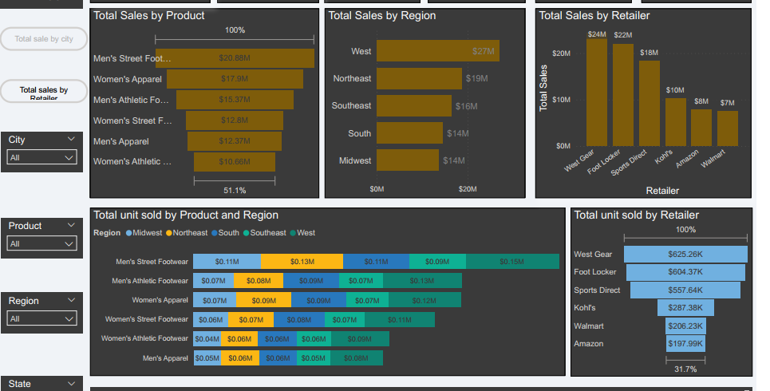

# Sport-Sales-Analysis

---

## Introduction :

This is a power BI project on sport sales analysis. As more sports brand emerged in the
market, the sales analysis is significant to provide insights for the investors to
compete with rivals and see market trend.The project is to analyze and derive insights to answer crucial questions and help the store make data driven decisions.

## **_Disclaimer_**: 
_All dataset and reports do not represent any company, institutuion or country, but just dummy dataset obtained from linkedin challenge group to demonstrate capabilities of power BI_

## Skills demonstrated:
The following Power BI features were incorporated:
- Bookmarking
- DAX
- measures
- Button

## Problem Statement:
Here are some of the areas that need to be answered.
1. Sales analysis by product category
2. Sales analysis by sales channel
3. Sales analysis by customer segmentation
4. Profitability analysis by product
5. Price strategy for products
6. Geographical sales trend by different retailers
7. Sales analysis by region/state

## Aims and Objectives
- Interpret the data 
- identify key trends and patterns
- present findings clearly, comprehensively, and compellingly
 

## Modelling:
Automatically, derived relationships are adjusted to remove and replace unwanted relationships. here, the dimensional table was modelled.

The Model is a star schema. There are two tables where one is fact table while the other is dimension table. The dimension table is the date table while the fact table is the sport product table. The dimension table was joined to the fact table and the relationship between them is many-to-one relationship.

## Visualization:

The report comprises of 2 pages:
1. Sales by product category
2. Sales by region
3. Sales by retailer
4. sales by sales method

## Sales by product category, retailer

## Analysis:
There are 6 retailers, 6 products, 50 states, 52 cities, 5 regions and 9,644 transactions. The analysis showed a 42% operating profit margin

## Conclusion and recommendation
At $24,296,431, West Gear had the highest Total Sales and was 225.87% higher than Walmart which had the lowest Sales at $7,455,836. West Gear accounted for 27.00% of Total Sales. Men's Street Footwear in Region made up 6.08% of Total unit sold. Across all 5 Region, Total Sales ranged from $13,580,031 to $26,994,314. New York had the highest Total Sales at $6,422,911 folllowed by California, Florida and Texas. New York in state made up 4.42% of total sales. New York had the average Total salesnat $3,211,455.50 followed by California, Florida and Texas

From the Analysis, it is seen that alll the products sold more in the west and sold less in the Southeast and midwest region. thus proper investigation should be carried out as to why preoducts sold more in nthe west and less in the southeast  and midwest. So as to ascertain new strategies to sell more products in the region less favourable.
